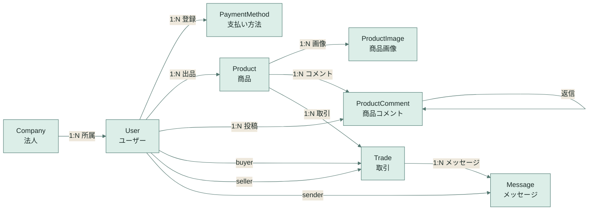

# Equip Exchange ER図

最初に全体の関係だけを見て、必要になったら下の属性一覧を見る構成にしています。

PlantUML 版も用意しています。図としての見やすさやレイアウト調整を重視する場合は [docs/er-diagram.puml](docs/er-diagram.puml) を使ってください。

## 概要図

## エンティティ一覧

### Company

| カラム | 型 | 備考 |
| --- | --- | --- |
| id | int | PK |
| name | string | 会社名 |
| corporate_number | string | UK |
| address | string | 所在地 |
| is_verified | boolean | 審査済み |
| created_at | datetime | 登録日時 |

### User

| カラム | 型 | 備考 |
| --- | --- | --- |
| id | int | PK |
| company_id | int | FK -> Company |
| username | string | ログイン名 |
| first_name | string | 名 |
| last_name | string | 姓 |
| email | string | メールアドレス |
| is_company_admin | boolean | 法人管理者 |
| is_staff | boolean | Django 管理者権限 |
| is_active | boolean | 有効フラグ |
| date_joined | datetime | 登録日時 |

### PaymentMethod

| カラム | 型 | 備考 |
| --- | --- | --- |
| id | int | PK |
| user_id | int | FK -> User |
| cardholder_name | string | カード名義 |
| brand | string | ブランド |
| last4 | string | 下4桁 |
| exp_month | int | 有効期限月 |
| exp_year | int | 有効期限年 |
| token | string | UK |
| is_default | boolean | デフォルト |
| created_at | datetime | 登録日時 |

### Product

| カラム | 型 | 備考 |
| --- | --- | --- |
| id | int | PK |
| seller_id | int | FK -> User |
| name | string | 商品名 |
| description | text | 商品説明 |
| price | int | 価格 |
| condition | string | 商品状態 |
| location | string | 表示用地域 |
| postal_code | string | 郵便番号 |
| prefecture | string | 都道府県 |
| city | string | 市区町村 |
| town | string | 町名 |
| block | string | 丁目・番地・号 |
| address_line | string | 建物名・部屋番号 |
| latitude | float | 緯度 |
| longitude | float | 経度 |
| is_sold | boolean | 売却済み |
| created_at | datetime | 出品日時 |

### ProductImage

| カラム | 型 | 備考 |
| --- | --- | --- |
| id | int | PK |
| product_id | int | FK -> Product |
| image | string | 画像パス |
| created_at | datetime | 登録日時 |

### ProductComment

| カラム | 型 | 備考 |
| --- | --- | --- |
| id | int | PK |
| product_id | int | FK -> Product |
| user_id | int | FK -> User |
| reply_to_id | int | FK -> ProductComment |
| body | text | コメント本文 |
| created_at | datetime | 投稿日 |

### Trade

| カラム | 型 | 備考 |
| --- | --- | --- |
| id | int | PK |
| product_id | int | FK -> Product |
| buyer_id | int | FK -> User |
| seller_id | int | FK -> User |
| price | int | 取引価格 |
| status | string | paid, shipped, completed, cancelled |
| payment_method_brand | string | 支払いブランド |
| payment_method_last4 | string | 支払い下4桁 |
| paid_at | datetime | 支払い日時 |
| created_at | datetime | 取引開始日時 |
| updated_at | datetime | 更新日時 |

### Message

| カラム | 型 | 備考 |
| --- | --- | --- |
| id | int | PK |
| trade_id | int | FK -> Trade |
| sender_id | int | FK -> User |
| body | text | メッセージ本文 |
| created_at | datetime | 送信日時 |

## 補足

- Trade は Product に対して複数作れますが、paid と shipped の間は同一商品で 1 件だけ有効です。
- ProductComment は self reference を持ち、reply_to_id で返信ツリーを表現しています。
- Product の所在地表示は seller.company.address をもとに補助的に扱われるため、住所の主責務は Company 側にもあります。

## 運用メモ

- 関係だけ追いたい場合は概要図を見る。
- カラム定義まで必要な場合はエンティティ一覧を見る。
- 図の見た目や配置を調整したい場合は PlantUML 版を更新する。
- モデル追加や外部キー変更が入ったら、このファイルを更新してください。